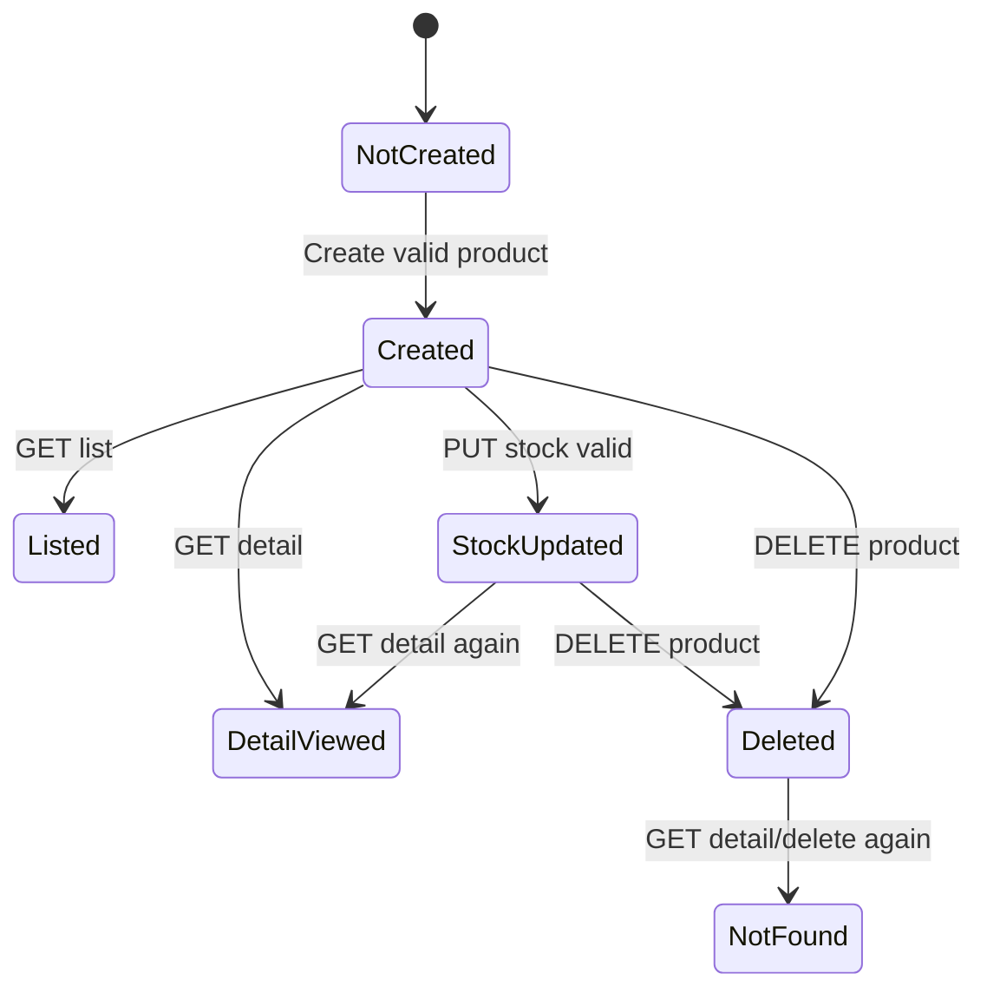

# Assignment: Kiem thu black-box module Product Admin

**Chu de:** Phan hoach lop tuong duong, phan tich gia tri bien, decision table, state transition va automation test  
**Module:** Product Admin  
**Du an:** VGA Store  
**Pham vi:** Create Product, List Product, Product Detail, Update Stock, Delete Product  
**Hinh thuc:** Bao cao co the ung dung vao CI/CD voi Postman/Newman va Jira failure log

---

## 1. Muc tieu bao cao

1. Xac dinh dieu kien test cho cac API Product Admin.
2. Ap dung cac ky thuat black-box:
   - Equivalence Partitioning.
   - Boundary Value Analysis.
   - Decision Table Testing.
   - State Transition Testing.
3. Thiet ke test case co input, expected result, priority, status va tag bao phu.
4. Mapping test case sang collection/CSV Postman hien co.
5. Lam co so de dua module Product Admin vao CI/CD tu dong.

---

## 2. Mo ta module Product Admin

Product Admin cho phep tai khoan ADMIN quan ly san pham trong he thong VGA Store.

Chuc nang chinh:

- Tao san pham moi.
- Lay danh sach san pham.
- Xem chi tiet san pham.
- Cap nhat ton kho.
- Xoa san pham.

Tien dieu kien:

- Admin da dang nhap va co token hop le.
- Brand va Category hop le ton tai trong he thong khi tao product.
- Product test ton tai khi test detail/update/delete.

---

# PHAN A. XAC DINH DIEU KIEN TEST

## 3. Test conditions

| ID | Function/API | Dieu kien co the kiem tra | Priority |
| :--- | :--- | :--- | :---: |
| PC-01 | Create Product | Admin token hop le moi duoc tao product | High |
| PC-02 | Create Product | Ten san pham khong rong, do dai hop le | High |
| PC-03 | Create Product | Gia san pham phai la so duong | High |
| PC-04 | Create Product | So luong ton kho phai la so nguyen khong am | High |
| PC-05 | Create Product | BrandId/CategoryId phai ton tai | High |
| PC-06 | Create Product | Mo ta, thong so, anh san pham khong lam API crash | Medium |
| PC-07 | List Product | Admin lay danh sach san pham thanh cong | High |
| PC-08 | List Product | Phan trang/sap xep xu ly bien page/size | Medium |
| PC-09 | Detail Product | Product ton tai tra ve dung thong tin | High |
| PC-10 | Detail Product | Product khong ton tai tra ve 404/loi phu hop | High |
| PC-11 | Update Stock | Stock hop le cap nhat thanh cong | High |
| PC-12 | Update Stock | Stock am/khong phai so bi tu choi | High |
| PC-13 | Delete Product | Product ton tai xoa thanh cong | High |
| PC-14 | Delete Product | Xoa lai product da xoa khong duoc thanh cong lan 2 | High |

---

# PHAN B. KY THUAT BLACK-BOX

## 4. Equivalence Partitioning

| Bien/Dieu kien | Lop hop le | Tag | Lop khong hop le | Tag |
| :--- | :--- | :---: | :--- | :---: |
| Admin token | Token ADMIN hop le | PV1 | Thieu token, token sai, token USER | PX1 |
| Product name | 3-255 ky tu, khong rong | PV2 | Rong, chi khoang trang, qua dai | PX2 |
| Price | So duong, >= 1 | PV3 | 0, so am, text, null | PX3 |
| Stock | So nguyen >= 0 | PV4 | So am, text, so thap phan neu backend yeu cau integer | PX4 |
| BrandId | Ton tai | PV5 | Khong ton tai, null, sai kieu | PX5 |
| CategoryId | Ton tai | PV6 | Khong ton tai, null, sai kieu | PX6 |
| ProductId | Ton tai | PV7 | Khong ton tai, da xoa, sai format | PX7 |

---

## 5. Boundary Value Analysis

| Bien | Min invalid | Min | Nominal | Max | Max invalid | Tag |
| :--- | :---: | :---: | :---: | :---: | :---: | :--- |
| `name.length` | 0/1/2 | 3 | 20-60 | 255 | 256 | PB1-PB5 |
| `price` | 0 | 1 | 1000000 | Theo rule business | Vuot max neu co | PB6-PB10 |
| `stock` | -1 | 0 | 10 | 9999 | Vuot max neu co | PB11-PB15 |
| `page` | -1 | 0 | 1 | n | Qua lon | PB16-PB20 |
| `size` | 0 | 1 | 10/20 | 100 | 101 | PB21-PB25 |

Ghi chu: neu backend chua co max ro rang cho price/stock/name thi test van nen de xuat max muc tieu. Neu API accept gia tri bat thuong, do la bug/diem chua toi uu can log Jira.

---

## 6. Decision Table cho Create Product

| Rule | Token ADMIN | Name valid | Price valid | Stock valid | Brand/Category valid | Action mong doi |
| :---: | :---: | :---: | :---: | :---: | :---: | :--- |
| R1 | Y | Y | Y | Y | Y | Tao product thanh cong |
| R2 | N | Y | Y | Y | Y | 401/403 |
| R3 | Y | N | Y | Y | Y | 400 validation name |
| R4 | Y | Y | N | Y | Y | 400 validation price |
| R5 | Y | Y | Y | N | Y | 400 validation stock |
| R6 | Y | Y | Y | Y | N | 400/404 brand/category |
| R7 | Y | N | N | N | N | 400 validation tong hop, khong tao product |

---

## 7. State Transition cho Product

Bang test state:

| Test ID | Start state | Event/Input | Expected output/end state |
| :--- | :--- | :--- | :--- |
| PST-001 | NotCreated | Create valid product | Created |
| PST-002 | Created | GET detail | DetailViewed |
| PST-003 | Created | Update stock valid | StockUpdated |
| PST-004 | StockUpdated | GET detail | Detail contains new stock |
| PST-005 | Created/StockUpdated | Delete product | Deleted |
| PST-006 | Deleted | GET detail | 404/NotFound |
| PST-007 | Deleted | Delete again | 404/NotFound or idempotent response theo rule |

---

# PHAN C. TEST CASE TONG HOP

| STT | Test ID | Function | Input chinh | Expected status | Expected result | Tag | Priority | Status |
| ---: | :--- | :--- | :--- | :---: | :--- | :--- | :---: | :---: |
| 1 | PA-001 | Create Product | Full valid payload | 200/201 | Tao product thanh cong, co productId | PV1-PV6,R1 | High | Ready |
| 2 | PA-002 | Create Product | Thieu admin token | 401/403 | Bi chan quyen | PX1,R2 | High | Ready |
| 3 | PA-003 | Create Product | Token USER | 403 | Bi chan quyen admin | PX1,R2 | High | Ready |
| 4 | PA-004 | Create Product | Name rong | 400 | Bao loi name | PX2,R3,PB1 | High | Ready |
| 5 | PA-005 | Create Product | Name min length | 200/201 | Tao thanh cong | PV2,PB2 | Medium | Ready |
| 6 | PA-006 | Create Product | Price = 0 | 400 | Bao loi price | PX3,R4,PB6 | High | Ready |
| 7 | PA-007 | Create Product | Price = 1 | 200/201 | Tao thanh cong | PV3,PB7 | High | Ready |
| 8 | PA-008 | Create Product | Price am | 400 | Bao loi price | PX3,R4 | High | Ready |
| 9 | PA-009 | Create Product | Stock = -1 | 400 | Bao loi stock | PX4,R5,PB11 | High | Ready |
| 10 | PA-010 | Create Product | Stock = 0 | 200/201 | Tao product het hang hop le neu business cho phep | PV4,PB12 | Medium | Ready |
| 11 | PA-011 | Create Product | BrandId khong ton tai | 400/404 | Khong tao product | PX5,R6 | High | Ready |
| 12 | PA-012 | Create Product | CategoryId khong ton tai | 400/404 | Khong tao product | PX6,R6 | High | Ready |
| 13 | PA-013 | List Product | Page/size hop le | 200 | Tra danh sach | PC-07 | High | Ready |
| 14 | PA-014 | List Product | page = -1 | 400 | Bao loi phan trang | PB16 | Medium | Ready |
| 15 | PA-015 | Detail Product | productId ton tai | 200 | Tra dung product | PV7,PST-002 | High | Ready |
| 16 | PA-016 | Detail Product | productId khong ton tai | 404 | Bao khong tim thay | PX7 | High | Ready |
| 17 | PA-017 | Update Stock | stock = 200 | 200 | Cap nhat thanh cong | PV4,PST-003 | High | Ready |
| 18 | PA-018 | Update Stock | stock = -1 | 400 | Bao loi stock | PX4,PB11 | High | Ready |
| 19 | PA-019 | Delete Product | productId ton tai | 200 | Xoa thanh cong | PST-005 | High | Ready |
| 20 | PA-020 | Delete Product | Xoa lai product da xoa | 404 | Bao khong tim thay | PST-007 | Medium | Ready |

---

# PHAN D. MAPPING AUTOMATION

## 8. Mapping Postman/Newman

Collection hien co:

`automation/postman/VGA-Store-Admin/VGA Store Admin.postman_collection.json`

CSV hien co:

- `automation/postman/VGA-Store-Admin/VGA_Store_Admin_TestCases.csv`
- `automation/postman/VGA-Store-Admin/VGA_Admin_BVA_TestCases.csv`

Folder/API lien quan trong collection:

| Folder | Request lien quan |
| :--- | :--- |
| Auth Admin | Register/Login admin de lay `adminToken` |
| Brand & Category Management | Tao brand/category tien dieu kien |
| Product Management | Tao product, list, detail, update stock |
| Dashboard & Cleanup | Xoa product |

Cot CSV nen chuan hoa them de Jira log dep:

| Cot | Muc dich |
| :--- | :--- |
| `testId` | Ma test case, vi du `PA-001` |
| `module` | `PRODUCT_ADMIN` |
| `function` | `CREATE_PRODUCT`, `LIST_PRODUCT`, `DETAIL_PRODUCT`, `UPDATE_STOCK`, `DELETE_PRODUCT` |
| `technique` | `EP`, `BVA`, `DecisionTable`, `StateTransition` |
| `endpoint` | Endpoint API |
| `input` | Du lieu chinh cua case |
| `expectedStatus` | HTTP status mong doi |
| `expectedMessage` | Message/result mong doi |
| `priority` | High/Medium/Low |
| `status` | Ready/Automated/Blocked |

---

## 9. Ket luan

Module Product Admin nen co toi thieu 56 test case theo 5 function/API chinh. Bo report nay ap dung du cac ky thuat trong slide: xac dinh dieu kien test, equivalence partitioning, boundary value analysis, decision table va state transition. Khi dua vao CI/CD, loi fail nen log len Jira kem `testId`, endpoint, input, expected/actual status va expected/actual message.
